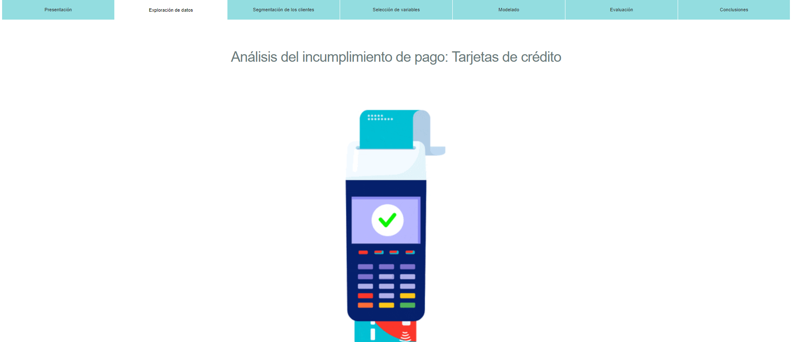
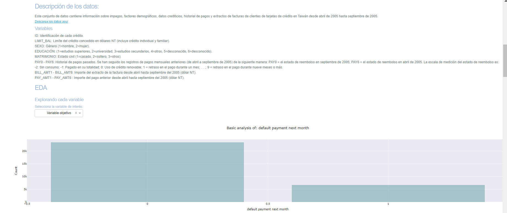
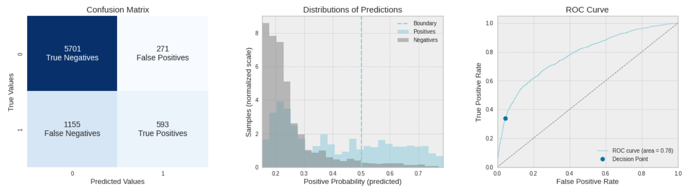
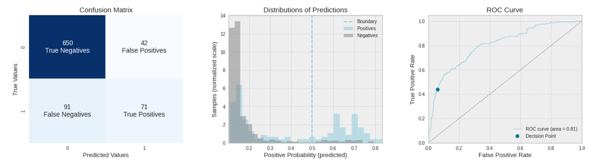

# Análisis del incumplimiento de pago: Tarjetas de crédito

En objetivo de este proyecto es predecir la probabilidad de incumplimiento de una determinada obligación, en este caso tarjetas de crédito. Esto permitirá generar estrategias que minimicen el riesgo del deterioro de la salud financiera del cliente. Adicionalmente, con el fin de facilititar el desarrollo de las estrategias de cobranzas, se plantea emplear algoritmos de clusterización que permitan encontrar segmentos homogenéos dentro de la población y de esta manera dar un trato diferencial a cada cliente.

## Link para la aplicacion web https://defaultappnataliacastilla.herokuapp.com/

## Sobre este repositorio
En este repositorio encontrarás todo lo necesario para reproducir mi trabajo

* notebooks: Encontrarás el código para reproducir todo.
* models: Están todos los modelos realizados
* imgs: Se encuentran todas las imágenes realizadas tanto en la exploración, preprocesamiento y clusterización
* data: Fuente de datos empleada: https://archive.ics.uci.edu/ml/datasets/default+of+credit+card+clients

## Modelos y resultados

Para seleccionar el modelo, para cada cluster, entrenamos 4 modelos diferentes de clasificación binaria: SVM, XGB, KNN, NB (Cada uno de naturaleza diferente). Para garantizar el desempeño de cada uno se empleó K-fold en el cual particionamos los datos 10 veces. De esta manera obtenemos una lista de scores de los cuales podemos obtener algunas estadísticas básicas: desviación estándar, media, promedio; La métricas empleadas para la evaluación en cada Fold fueron: AUC, F1-Score y Acuraccy. Para balancear los datos empleamos SMOTE-TOMEK el cual crea una muestra artificial según los vecinos más cercanos de cada punto.

El modelo con mejor desempeño fue el Xgboost para ambos casos, a continuación se muestra un resumen de las métricas obtenidas
**Modelo 1: Cluster 1**

**Modelo 2: Cluster 2**

## Prerrequisitos

* python3
* python packages in the requirements.txt file

Instala los paquetes con:

* pip install -r requirements.txt

